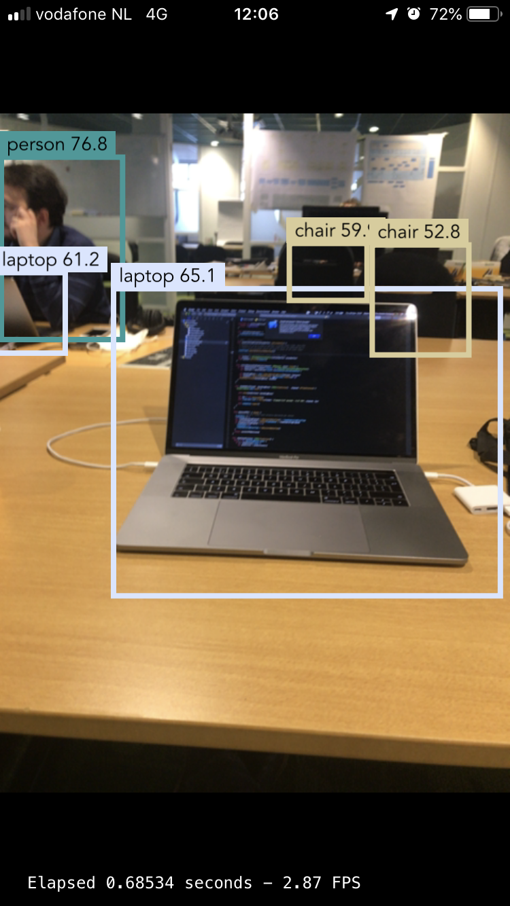

# YOLOv3 CoreML

[Paper on YOLOv3](https://arxiv.org/abs/1804.02767)

[Darknet Github](https://github.com/pjreddie/darknet)

[Darknet Website](https://pjreddie.com/darknet/)

The [converted CoreML model](https://github.com/0xPr0xy/YOLO-v3-COCO-CoreML/blob/master/YOLO-CoreML/yolo.mlmodel) is included in this repository

## YOLOv3 on COCO dataset

Demo application is functional and contained in this repo.

Preview:

